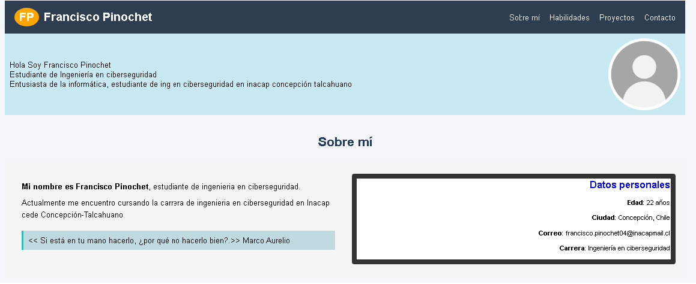
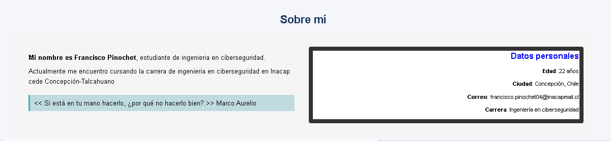
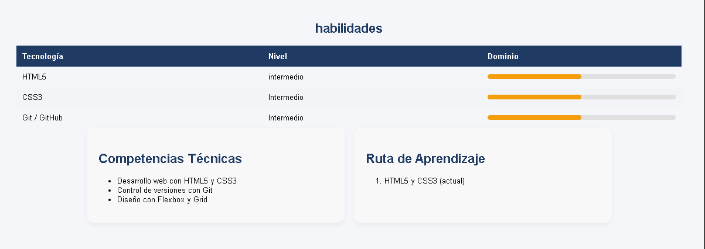
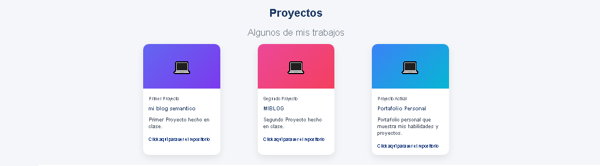

Este proyecto corresponde a un sitio web personal tipo portafolio, desarrollado para presentar
información profesional, habilidades técnicas y proyectos realizados.

se uso HtML5 y CSS3 (usando Flexbox, grid, diseño responsivo)

caracteristicas
- Diseño responsivo
- Navegación con anclas internas
- Sección de proyectos con enlaces
- Formulario de contacto

Capturas de pantalla:

instrucciones de instalacion directo a visual studio code:

1. Abre visual studio code (asegurate de tener instalado git y las extensiones: HTML boilerplate, Live preview, File icons)
2. 
Crea una carpeta Para Clonar ahi el repositorio y abrela con visual studio code.
3. Abre la terminal de comandos con CTRL+J
  Clona este repositorio con el comando:
    git clone https://github.com/Furapin21/Evaluacion_1

